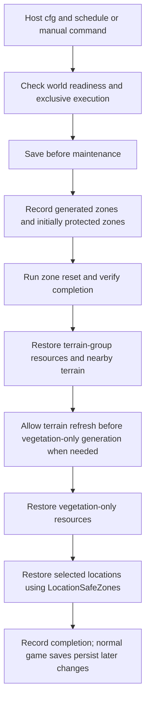

# Valheim world-reset mod comparison for FreshWorld

> Historical research and implementation record. Current protection automatically detects player-built Pieces, with `PieceBlacklist = fire_pit` replacing `PlayerPlacedObjects`. Tombstones remain separate markers. ServerSync is now embedded for optional administrator configuration. See the [README](../README.md) for current behavior; versioned implementation descriptions below retain their original scope.

Research date: **2026-09-06 (Asia/Seoul)**  
Design goal: make location, vegetation, zone, and terrain restoration accessible through configuration for single-player worlds, in-game local hosts, and dedicated servers. Scheduled use should not require users to write console commands.

**Current implementation: FreshWorld 1.0.2.** The author is sighsorry, the plugin ID is `sighsorry.FreshWorld`, and the active cfg is `BepInEx/config/sighsorry.FreshWorld.cfg`. The only required mod dependency is **BepInExPack Valheim**. FreshWorld uses its own reset engine; it does not call Upgrade World, Cron Job, or Server Devcommands. It does not implement `world_clean` or visit-based policies. Configuration has 15 options in General, Reset, and Protection. Automatic scheduling defaults to every 24 game days. `Mode` accepts `GameDays` or `DailyTimes`; `Enabled` controls automatic scheduling only, and manual commands remain available with either value.

`TerrainResourceIds` restores selected vegetation and nearby terrain; `ResourceIds` restores vegetation without terrain reset. The default terrain group retains copper and silver ore restoration. The three reset stages have independent SafeZones values, and `LocationSafeZones=0` replaces the former separate Force option. Execution is: save before maintenance → zones → resources with terrain restoration → vegetation-only resources → locations → completion. No additional save is requested afterward. Automatic deadlines are checked internally once per second. Version 0.6.1 removed `BlackForest_DG_RtD` and `Mountain_DG_RtD` from the default location list; 0.6.4 also removes `Mistlands_Giant1:dark`, `FortressRuins`, and `AshlandRuins` and adds `CharredFortress`, leaving 14 IDs including the regular `Mistlands_Giant1`. Historical examples below retain their original lists.

With zone reset enabled, supplemental passes only consider zones retained by the initial base-protection plan that are still generated. With zone reset disabled, each supplemental pass considers the currently generated zones. `PlayerPlacedObjects` exposes the full editable marker list, including additions, removals, and an empty list. Tombstones remain a separate marker without a creator requirement. All markers protect zones only when that stage's SafeZones value is greater than zero.

Current FreshWorld accepts only SafeZones 0 (no protection), 1 (the marker's zone), and 2 (its 3 x 3 neighborhood). Other values, including existing values of 3 or higher, block new work until manually corrected. The broader Upgrade World ranges documented below describe the reviewed upstream source, not FreshWorld's current configuration. Optional Configuration Manager controls keep the same 15 keys and validation; `Enabled` appears as `Automatic Runs`. Mode and SafeZones use native choice popups that overlay the settings with a dimmed, disabled background without expanding rows. Toggles, numeric inputs, and text fields for times and ID lists remain. A lossless ConfigChoice wrapper preserves the original cfg text for Mode and SafeZones through a BepInEx converter; other entries remain strings. The editor adds no required dependency or remote synchronization, and the in-game UI remains unverified.

The repository comparison below is a **historical research record**, not an installation guide for the current release. See the [README](../README.md), [current configuration example](../config/FreshWorld.example.cfg), and [configuration simplification record](FreshWorld-config-simplification-review.md) for the current specification. The earlier Upgrade World dependency recommendation and global-queue limitations explain the original design path. Code attribution and the Unlicense notice are retained in [THIRD_PARTY_NOTICES.md](../THIRD_PARTY_NOTICES.md). FreshWorld has been built against original game DLLs and checked with game-independent tests; actual local-host and dedicated-server world-reset testing remains outstanding.

## 1. Initial conclusions and later implementation choices

The initial recommendation was a configuration-driven FreshWorld controller with an Upgrade World dependency. That approach was implemented in 0.1.x. The requirement to reduce installation dependencies and omit `world_clean` led **0.2.0 to incorporate the required reset engine code**. Version 0.3.0 added commands for the local host and remote administrators. The central policy remains zone reset first, followed by ore/terrain and location supplements. A dedicated UI, visit tracking, and an arbitrary standalone terrain-editing tool remain outside the current scope.

| Question | Finding from the inspected source |
|---|---|
| Is Cron Job dedicated-server-only? | **No.** It explicitly tracks the non-dedicated host's position, and its general update loop has no dedicated-only restriction. A particular installed build still needs runtime verification. |
| Can Upgrade World run on a local host? | The host's own direct execution path exists. A different administrator asking a local host to execute through UW's own RPC is a separate limitation. |
| Does VentureValheim provide all four reset types as one mod? | **No.** It is a repository of independent mods. Location Reset and Terrain Reset have different purposes; neither provides a general vegetation/zone reset engine. |
| Is Cron Job necessary for command-free use? | **No.** FreshWorld can provide configuration presets and scheduling. Even a historical adapter that generated UW commands internally did not require users to type them. |
| Does UW expose a complete task API? | Public implementation classes exist, but a stable SDK with task IDs, completion results, and cancellation was not identified. Integration required an adapter for the inspected version. |
| Does UW have a single standalone terrain-reset command? | No dedicated command was identified in the inspected version. Its terrain helper would need a wrapper or a separate implementation. |

Sources: [Cron update loop][C1], [host position tracking][C2], [UW local execution decision][U1], [UW RPC registration][U2], [UW queue][U3], [UW terrain helper][U4], and [Venture repository overview][V0].

## 2. Research scope and confidence

The initial investigation statically reviewed the three public repositories' READMEs, plugin metadata, and C# execution paths. It did not build or run those upstream mods or reset a live world. FreshWorld's later builds and automated tests are separate work. A source-level execution path therefore means less than verified compatibility with a particular Valheim version and installed mod combination.

The user's Cron YAML and operating intent informed the design. Their installed versions and execution logs were not inspected, so this report does not establish why Cron did or did not work in a particular local installation.

| Repository | Inspected branch / pinned commit | Version reported by the inspected source | Repository HEAD commit timestamp at inspection |
|---|---|---|---|
| Upgrade World | main / [f1e3b21140a9d7865d204910a1ed40a3df93297b](https://github.com/JereKuusela/valheim-upgrade_world/commit/f1e3b21140a9d7865d204910a1ed40a3df93297b) | Package manifest 1.80.0 | 2026-05-21 20:51:15 +03:00 |
| VentureValheim | master / [b1599ab7c7d500c61d0f9d17f9af827fef55fd52](https://github.com/OrianaVenture/VentureValheim/commit/b1599ab7c7d500c61d0f9d17f9af827fef55fd52) | Location Reset 0.10.9 / Terrain Reset 0.1.2 | 2026-09-04 20:16:05 -05:00 |
| Cron Job | main / [5344fc06c65d0325fa4d6cd728ed9e0b26aef454](https://github.com/JereKuusela/valheim-cron_job/commit/5344fc06c65d0325fa4d6cd728ed9e0b26aef454) | Package manifest 1.13.0 | 2026-03-15 20:32:06 +02:00 |

These are **source versions**, not a claim about the latest distributed binaries or the user's installed versions. VentureValheim's timestamp belongs to the whole repository, not necessarily the last modification of either reset mod. Source links are pinned to the inspected commits.

### Terms that should remain distinct

- **Location:** a place assigned by world generation, such as a dungeon entrance, ruin, or camp. Its surface entrance and elevated dungeon interior may have different bounds.
- **Vegetation:** entries in the world's vegetation generation registry, including trees, rocks, and ores. Decorative ground grass, called clutter, is a separate system.
- **Zone:** the basic world-generation and management grid. UW uses 64 m zone coordinates. Resetting a zone returns it to an ungenerated state and can remove its objects.
- **Terrain reset:** removal of terrain modifications such as height changes, leveling, cultivation, and paving. It does not mean changing the world seed or biome distribution.

A product may group these under restoration, but its descriptions should still distinguish their effects and affected areas. See [UW zone reset][U5], [vegetation reset][U6], [terrain reset][U4], and [Venture terrain reset][V7].

## 3. Features and interaction models

| Aspect | Upgrade World | Venture Location Reset | Venture Terrain Reset |
|---|---|---|---|
| Main purpose | Manage and regenerate broad areas of an existing world | Restore visited locations after a configured number of game days | Restore terrain modifications around the user |
| Location reset | Selected location IDs and area filters | Proximity, elapsed days, ownership, and activity checks | None |
| Vegetation reset | Selected IDs from the generation registry | A specialized Leviathan regeneration path only | None; refreshing grass is not vegetation regeneration |
| Zone reset | ZDO removal and ungenerated-state transition | No general feature | None |
| Terrain reset | Included in location regeneration, optional around vegetation, and available through an internal helper | Included around regenerating locations | The mod's main standalone feature |
| Automatic execution | Requires a separate policy layer | Triggered when a location is approached | Triggered by user input |
| Use without console commands | Add a configuration controller or UI | Automatic restoration itself needs no command | Tool modifier keys and hotkeys |
| Handling unloaded areas | Direct ZDO processing or zone preparation, depending on the operation | Primarily loaded locations, scenes, and clients | Primarily loaded Heightmap/TerrainComp instances |
| Base/player protection | Configured base markers and excluded surrounding zones | Player structures, tombstones, and player-activity checks | Ward access and no-build checks |
| Work management | Global queue, start/stop, progress logs | Coroutines for individual approach events | Immediate local processing |
| Relevance to FreshWorld | Original reset-engine candidate | Reference for reset policies and location-specific exceptions | Reference for terrain restoration interaction and algorithms |

Sources: UW's [location][U7], [vegetation][U18], and [zone][U19] command handlers; [UW location generation][U8]; [Venture approach checks][V1]; [Leviathan-only processing][V2]; and [Terrain Reset input and implementation][V7].

### 3.1 What the inspected UW reset operations change

**Locations.** UW regenerates a location at its existing position. This is regeneration rather than restoration from a backup, so a randomized dungeon can have a different interior layout. The common generation path also restores terrain. In that location path, `terrain=0` means **use the location's exterior radius**, not disable terrain restoration. Any future preserve-terrain option would need to handle that distinction explicitly. [Command description][U7], [LocationOperation][U8].

**Vegetation.** UW removes selected prefabs and some corresponding fragment prefabs (`_frac`), then reapplies generation rules. `terrain=N` specifies the restoration radius around newly placed vegetation; it is not a general reset of every terrain cell in an arbitrary area. An empty target set can mean all vegetation in UW, so an adapter must reject or skip an empty user selection before calling the engine. [ResetVegetation][U6].

The inspected `SetAmount` implementation adds to vegetation minimum and maximum amounts, despite README wording that describes a multiplier. A future UI should not label this as a density multiplier without verifying the resulting in-game behavior. [VegetationOperation][U27].

**Zones.** UW removes ZDOs in the zone, marks locations as unplaced, removes the zone from `m_generatedZones`, and releases its loaded zone root. Player character IDs are excluded from deletion, but ordinary player-built pieces are not inherently preserved. A zone that passes base-protection filtering is a full-reset target. Regeneration happens when subsequent zone-loading conditions require it. [ResetZones][U5].

**Terrain.** `ResetTerrain.Execute(Vector3 pos, float radius)` reads compressed `TCData` from `TerrainCompiler` ZDOs and clears height/paint modifications inside the radius. It queries server-side `ZDOMan` data rather than only searching for currently loaded TerrainComp instances. The helper itself does not supply administrator authentication, base exclusion, area planning, or structured task results, and it does not comprehensively remove legacy TerrainModifier objects. A standalone terrain feature would need those protections and client-refresh validation. [ResetTerrain][U4], [ZDO lookup in EntityOperation][U9].

Zone completion also repairs terrain modifications along neighboring generated-zone borders. Any map preview would need to distinguish the selected shape, actual 64 m grid coverage, and adjacent border effects. Location cleanup operates on the sector's ZDOs and also handles elevated interiors, so it should not be described as only deleting a ground-level circle. [ResetBorder][U20], [location cleanup helper][U21].

Changing world-generation versions, seeds, or biome generation should remain separate from these restoration presets. UW's `world_reset` combines location removal/redistribution and zone reset; it is not another name for `zones_reset`. [WorldReset][U22].

### 3.2 UW protection and preview limitations

UW does not infer the meaning of every player structure. It finds configured prefab types with creator metadata, plus a separate unconditional marker list, then excludes surrounding zones. Defaults include crafting stations, portals, and chests, with tombstones protected separately. Structures without a configured marker and modded bases may require explicit configuration. [PlayerBaseFilterer][U10], [Settings][U11].

The inspected source defaults `Safe zones` to **2**. The code's meaning is:

| Value | Protected area |
|---|---|
| 0 | Marker-based base protection disabled |
| 1 | The single zone containing a marker |
| 2 | A 3 × 3 group of zones around the marker |
| 3 | A 5 × 5 group of zones around the marker |

Where README text differs, verify the code and generated settings. UW converts `force` to `SafeZones=0`. The original recommendation was to make that an explicit choice rather than silently enabling it. Location and vegetation effects may also cross zone boundaries, which matters when evaluating the resulting protected area. [Filter parameters][U12].

UW's queue is not a side-effect-free preview API. `Executor.AddOperation` initializes and enqueues work; **global AutoStart can start it even if the caller supplies `autoStart=false`**. A preview must therefore be computed separately without adding an operation to the queue. [Executor][U3].

Likewise, `uw_check` calls `GetInfo()`, which invokes `OnInit()` again. That can reapply zone filters and further reduce a chance-filtered selection. It should not be treated as a pure status read. [Operation information][U23], [zone initialization][U24], [`uw_check`][U25].

## 4. Local hosts and dedicated servers

Here, a **local host** means a listen server: a player opens a world in the game and accepts other players. A separate `valheim_server` process remains a dedicated server even when it runs on the same PC as a client.

| Environment | Upgrade World | Venture Location Reset | Venture Terrain Reset | Cron Job |
|---|---|---|---|---|
| Single player / host player | Direct execution because the process is the server | Client watcher and ownership conditions | Local tools/hotkeys | General scheduling and host-zone tracking paths exist |
| Another administrator connected to a local host | UW's own incoming remote RPC is not registered on the host | An installed client can operate when it owns the relevant object | Installed client's tool actions | A client's Cron installation should not be assumed to execute on the server |
| Dedicated server with players | Direct server execution or administrator RPC | An approaching client performs restoration | Client changes are reflected in the world | Commands run in the server process |
| Dedicated server without players | Server operations are possible in the source; each operation needs verification | Installing only on the server does not automatically restore locations | No complete headless global automation feature | General jobs have an execution path; player-zone jobs have no nearby-player candidates |

This table describes source structure, not certified game compatibility. [UW execution decision][U1], [UW RPC registration][U2], [Venture watcher registration][V3], [Venture visit coroutine][V1], [Cron tracking][C2].

### 4.1 UW's local-host remote-execution limitation

UW's `Helper.IsClient` handles a command locally when `ZNet.IsServer()` is true. The host's own command therefore has a direct execution path. However, `ServerExecution` registers `UpgradeWorld_Command` and `UpgradeWorld_RequestSync` during `RPC_PeerInfo` only when **`IsDedicated()` is true**. [Helper][U1], [ServerExecution][U2].

These are distinct requirements:

1. The host asks their own world to perform restoration.
2. A different administrator asks that host to perform restoration over the network.

The historical integration recommendation was to provide a request path for every `IsServer()` host type and perform mutations on that server. Wrapping UW's remote call in a button alone would miss the second case. Another mod might provide its own forwarding path, but the limitation identified here concerns UW's own RPC. Current FreshWorld uses its own command authorization and server execution flow rather than depending on this UW receiver.

### 4.2 Venture Location Reset is not a server-only reset engine

Automatic watchers are registered only on `!IsDedicated()` instances. A watcher checks local-player distance, area readiness, LocationProxy ownership, and dungeon-generator ownership when applicable. Restoration primarily operates on loaded scene objects. A key role of the dedicated-server installation is synchronizing configuration through Jotunn; **the execution mechanism requires client installation**. [Registration][V3], [approach checks][V1], [installation requirements][V4].

If a location has no timer, the first visit records the current game day without resetting it. On a later load/approach, restoration is attempted once the configured interval has elapsed. The default `ResetTime` is **30 game days**. This is neither a world-wide sweep every 30 days nor a rule requiring 30 days without any visitor. The stored value is the reset baseline; it is not a last-visit timestamp refreshed on every visit. [LocationProxyExtension][V1], [settings][V5].

The mod checks player structures, tombstones, and players separately for surface areas and elevated interiors, and has special handling for some locations. Its manual `resetlocations` command bypasses timing and player-activity protection. The original design therefore advised against connecting that function directly to an ordinary safe-reset button. [Activity checks and regeneration][V3], [manual command][V6].

The filename `ZoneSystemReset.cs` does not establish general zone-reset support. That code selects **Leviathans only** from vegetation entries for replacement. It is not a tree/ore regeneration service or a reset that removes entries from `m_generatedZones`. [ZoneSystemReset][V2].

This architecture distributes work around loaded, approached locations rather than continuously resetting the entire world. The initial source review did not benchmark its frame cost or establish a precise visit-distance measurement; no performance or distance guarantee should be inferred from this comparison. FreshWorld currently omits visit tracking.

### 4.3 Lessons from Venture Terrain Reset

Standalone Terrain Reset provides a default LeftAlt modifier with a hoe/cultivator, a configurable hotkey, and console access. The hotkey is disabled by default. Settings are local to each client, while the resulting terrain changes affect the multiplayer world. [Plugin input][V8], [usage][V9].

The core function finds nearby Heightmap, TerrainModifier, and TerrainComp instances, obtains ownership, clears modification arrays, and saves/refreshes the result. **Increasing the radius alone does not reset every unloaded area.** Hotkey and command entry points assume a local player. Even if the coordinate-based helper has no dedicated-server guard, that does not make it a complete headless global job. [Implementation][V7].

The standalone mod checks wards and no-build areas; Location Reset's internal terrain helper does not. That helper relies on the containing location activity checks. The two implementations should not be assumed to offer identical protection. The internal helper also excludes paint restoration from its return count, so the count is not a reliable complete success indicator. [Standalone implementation][V7], [internal helper][V10].

## 5. Can Cron Job run on a local host?

**The inspected code contains local-host execution paths.** Interpreting "install on the server" to include the game process actually hosting the world is supported by explicit non-dedicated host-position tracking and the absence of a dedicated-only update guard. This is a source-based conclusion, not a live test of the user's installation. [CronJob.cs][C1], [TrackManager][C2].

### 5.1 Execution evidence

| Code path | Finding |
|---|---|
| `CronJob.LateUpdate` | Runs periodically when `ZNet.instance` exists; no `IsDedicated` or `IsServer` guard |
| `TrackManager.Track` | Adds the non-dedicated local reference position to zone candidates |
| `TrackManager.GetPlayerZones` | Includes the non-dedicated host's position in `avoidPlayers` checks |
| `CronManager.RunJob` | Calls `Console.instance.TryRunCommand` in the same process |
| Join handling | Hooks server events for remote peers; no separate host-self join hook was identified |

Sources: [update loop][C1], [zone/player tracking][C2], and [command dispatch/join handling][C3].

Cron is a scheduler, not a reset engine. Running UW commands requires UW and its dependencies in the executing process. Cron has no separate command-forwarding RPC. UW may forward a command issued by a client, but that still follows UW's authorization and local-host RPC restrictions. [Cron manifest][C4], [Cron dispatch][C3], [UW forwarding][U1].

### 5.2 Diagnostic order for an apparently non-working local setup

1. **Check the host's actual mod profile.** A dedicated-server profile is separate from the profile used to open an in-game server. Confirm plugin loading and that profile's `BepInEx/config/cron.yaml`.
2. **Check schedule loading and time.** Inspect the `Reloading ... cron jobs` log, schedule values, and YAML syntax. The inspected defaults are UTC and a 10-second check interval, which matters when comparing against Korean local time.
3. **Distinguish general jobs from zone jobs.** General jobs submit scheduled commands. Zone jobs consider already generated zones around players; they are not periodic world-wide sweeps.
4. **Check whether the host's own presence defers work.** `avoidPlayers: true` also excludes the host's zone. It checks the same zone, not base markers or a broad safety radius.
5. **Check UW's actual result.** Cron's `Executing:` log is not confirmation of success: its dispatch path does not inspect the `TryRunCommand` result. Read UW completion/failure output and inspect the world separately.
6. **Check command permissions.** UW registers cheat commands, and Cron itself does not enable cheats. Local console state and Server Devcommands may affect execution; exact behavior needs testing against the relevant game version.
7. **Check whether UW is waiting to start.** Without automatic startup, submitting a UW operation may only queue it. Confirm whether the Cron command needs `start`.
8. **Check host shutdown and pause behavior.** Cron cannot run when the game process is closed. Its timer uses `Time.deltaTime`, so paused timescale behavior and missed schedules after reconnecting need verification.

Sources: [configuration, dispatch, and filters][C3], [profile storage and tracking][C2], [defaults][C5], [UW command registration][U17], and [UW execution queue][U3].

General Cron jobs can select game time, but **the inspected zone-job path uses real UTC timestamps**. Moving a game-day policy to a zone job does not preserve the timing policy automatically. [CronManager][C3].

### 5.3 Which mod owns the `Root users` value `-1`?

It belongs to **Upgrade World**, not Cron. For a dedicated-server command issued directly without a remote user, UW checks `IsRoot("-1")`. An empty Root users list allows the default server-self (`-1`) and administrator paths. If the list is explicitly restricted, it must include `-1` to allow that dedicated-server Cron path. [Helper.IsClient][U1], [Settings.IsRoot][U11].

The same check is not applied identically to a non-dedicated host's own direct execution. Adding `-1` is therefore not a general cure for any local-host Cron failure.

### 5.4 Why FreshWorld does not require Cron

Cron remains useful for existing YAML-based operations, but FreshWorld can provide its limited scheduling needs itself. The inspected Cron implementation also leaves several concerns for a host-oriented controller:

- Its general update loop lacks an `IsServer` guard; FreshWorld explicitly confines mutation to the hosting process.
- `cron_last.yaml` and `cron_track.yaml` are fixed files under the configuration directory, not world-UID-specific state files. A profile used for multiple worlds needs world separation.
- A zone timestamp is not an individual job's success result. One processed job can affect when another deferred job becomes eligible.
- The stored `world` key is a real-time timestamp, not a world UID, and should not be reused as a world identity.

Sources: [update loop][C1], [storage][C2], and [zone-job eligibility][C3]. Choose a single scheduler to own a given restoration policy so Cron and FreshWorld do not submit overlapping work for the same area.

## 6. Historical evaluation of Upgrade World integration

This section records the 0.1.x integration options. Since 0.2.0, FreshWorld has incorporated the required engine code and no longer directly uses the UW installation, SDK assumptions, or Executor queue described here.

### 6.1 Package dependencies and public APIs are different

The inspected UW package manifest declares BepInExPack and **Server Devcommands** dependencies. The absence of a `BepInDependency` attribute on its plugin does not remove those package dependencies. [Manifest][U13], [plugin declaration][U14].

`Upgrade.Register` in `developers.md` is an example that asks the consuming mod project to include helper code. It is not a formal task service exposed by UW's DLL, and no `Upgrade.Run(...)` API was found in the inspected implementation. The documented example ultimately registers and executes UW command strings. [Developer documentation][U15].

### 6.2 Integration options considered

| Approach | Benefit | Remaining work | Original recommended use |
|---|---|---|---|
| Command adapter | Reuse the parser and filters; quick to validate | Cheats/authorization, startup, global queue, lack of structured results | Initial technical proof |
| Direct use of public operation classes | Retain task objects and reduce console parsing | Internal API changes, validation/authentication, queue isolation | A backend limited to tested UW versions |
| Independent engine or maintained fork | Design results, cancellation, protection, and terrain behavior for FreshWorld | Maintain compatibility with Valheim generation, ZDOs, and networking | Requirements that an adapter cannot adequately serve |

Public entry points include `Executor.AddOperation`, `StartExecution`, `StopExecution`, `GetOperations`, and classes such as `ResetZones`, `ResetVegetation`, and `RegenerateLocations`. They are implementation access points rather than a documented stable service contract. Bypassing command handlers transfers their validation and server-selection responsibilities to the adapter. `FiltererParameters` also has no default constructor: it accepts console arguments or an existing parameter object. [Queue][U3], [location handler][U7], [vegetation handler][U18], [zone handler][U19], [parameter constructors][U26].

The recommendation at that time was a configuration controller with a version-limited UW adapter, reusing `terrain=20` for ore-area restoration. Version 0.2.0 moved the required behavior into the internal engine. Avoiding overlapping reset jobs from UW, Venture, and FreshWorld remains an operational concern even after removing dependencies.

### 6.3 Behavior an adapter had to handle

UW Executor uses a single static process-wide queue. Work from Cron, the console, and other mods can be mixed with FreshWorld's work. `StopExecution` clears the entire queue; it does not roll back world changes already made. [Executor][U3].

An empty UW queue does not prove that a particular FreshWorld task succeeded. An adapter needs its own IDs and a link to completion, cancellation, exceptions, and partial failure. A UW zone operation can count a failure and proceed to the next zone after 10 seconds of unsuccessful loading/processing. Reaching 100% progress therefore does not imply success for every zone. [ZoneOperation][U24].

The original approach limited simultaneous submissions and treated other queued UW work as a wait/conflict condition. A UI that cannot cancel only its own operation would need to explain the wider effect of stopping the backend. Protection and player positions also need rechecking between planning and execution. Neither atomic rollback nor a complete side-effect-free dry run should be claimed as an existing UW guarantee.

## 7. From the user's Cron workflow to FreshWorld

This section preserves the original operating intent and distinguishes it from the current configuration. `world_clean`, morning-only resource selection, and the old separate Force/SaveAfter options are historical features, not current FreshWorld settings.

### 7.1 Original YAML intent

The user's original sequence was:

1. Save the world before changes.
2. Run `world_clean` to remove unwanted world data. **This belonged to the original YAML and was omitted from FreshWorld starting in 0.2.0.**
3. Run `zones_reset safeZones=1 start` first, resetting zones outside base protection.
4. In the morning, run `vegetation_reset rock4_copper,silvervein terrain=20 safeZones=0 start` to restore remaining ore and nearby mined terrain.
5. Force-reset the selected locations to reach locations retained by zone protection.
6. In the evening, run cleanup, zones, and locations again; the supplied evening YAML did not include vegetation reset.

The central idea is **reset most of the world through zones first, then supplement what remains**. FreshWorld retains that sequence without requiring individual console syntax or cron expressions. The original 0.3.0 design also offered post-run saving; current FreshWorld requires only the pre-run save. Observing save start, worker completion, and reported errors is not equivalent to creating and verifying a separate backup.

### 7.2 What zone-first means for scope and speed

UW's default zone selection uses **generated zones, not only currently loaded zones**. `safeZones=1` does not reset at a resolution finer than the 64 m grid. It protects the one zone containing a marker. Reducing protection from 3 × 3 to 1 × 1 leaves more zones eligible for reset. [Zone enumeration][U28], [base filtering][U10].

`ResetZones` removes objects and generation state, deferring actual regeneration to later loading. Vegetation and location resets prepare the required zone and actively run placement functions. Deferring regeneration is a plausible explanation for the user's impression that zone-first was faster. This is a source-based explanation, not a measured benchmark or a guarantee that zone reset is always faster. [Zone operation][U5], [vegetation operation][U6], [location operation][U8].

Ore reset targets the selected ore and fragment prefabs. `safeZones=0` does not turn it into a command that directly deletes every ordinary player Piece. Ore overlap and terrain changes can still have indirect effects on structures and their foundations. [Ore removal and terrain restoration][U6].

### 7.3 Bundled UW/Cron YAML versus current FreshWorld

| Aspect | UW + Cron + YAML | Current FreshWorld |
|---|---|---|
| Configuration | Command strings and cron expressions | Stage switches, prefab lists, radii, and scheduling settings |
| Stage ordering | Submit commands at specified times | Create each operation after the preceding stage finishes successfully |
| Supplemental scope | Generated-zone state when the next command is constructed | Initially protected zones still generated, when zone reset is enabled |
| Forced locations | Add/remove `force` in the command | Select `LocationSafeZones=0`; no separate Force option |
| Local host | Install the required mods in the hosting game's profile | Run the same FreshWorld controller in any supported `IsServer()` host |
| Diagnostics | Correlate logs from several mods | Per-stage completion, failure, and no-target results |
| State and timing | Cron expressions and Cron's state files | World-specific execution history; no catch-up for deadlines missed while closed |

FreshWorld's host or dedicated-server configuration owns reset policy and scheduling. Remote administrators need the mod on their clients to use its manual command; ordinary connecting players do not. Compatibility with a particular content-mod combination still requires game testing. Cron is not required. Any future optional Cron integration should avoid duplicate scheduling of the same maintenance policy.

### 7.4 Replace one-minute submissions with completion-based sequencing

UW captures zone candidates when a `ZoneOperation` is constructed and applies initial filters in `Executor.AddOperation`. A sequential execution queue does not automatically defer the earlier target calculation. [Operation construction][U24], [Executor][U3].

If a zone reset submitted at 05:36 is still running at 05:37, a vegetation operation constructed at 05:37 may capture an old or intermediate target list. It can subsequently reload and regenerate zones already handled by the zone pass, reducing the intended savings. This is a source-supported possibility, not a claim that it occurred on the user's server.

Current FreshWorld instead follows this sequence:



Disabled stages are skipped. There is no fixed one-minute wait between stages. When both resource groups are present and the terrain radius is positive, two frame boundaries allow the terrain update cycle to complete before vegetation-only generation. This is a frame-level refresh handoff, not a timed scheduling gap.

FreshWorld constructs later operations after earlier stages finish, using its internal engine rather than UW's queue. A generated-zone snapshot taken after zone reset can include zones already regenerated near players. FreshWorld therefore retains the **initially protected zone-ID set** and intersects it with the current generated set immediately before each supplemental pass. This is a fixed policy, with no scope-selection setting. When zone reset is disabled, supplemental passes instead start from the currently generated world and apply their own ID/protection filters.

The 0.1.x adapter added completion and retained-zone tracking because UW did not supply a complete result API. Version 0.2.0 connected that tracking to the internal engine. UW's `world_clean` handler used a separate direct-operation path, which current FreshWorld does not include. [`world_clean` implementation][U29].

### 7.5 Historical 0.3.0 configuration example

**The following block is an archived 0.3.0 example. Do not use it as the current cfg format.** It retains the original location IDs and the former options for post-run saving, time zones, morning-only vegetation, and Force. The current 15-option format is in the [configuration example](../config/FreshWorld.example.cfg).

```ini
[General]
Enabled = true

[Pipeline]
SaveBefore = true
SaveAfter = true

[Schedule]
Mode = DailyTimes
TimeZone = Local
DailyTimes = 05:35,17:35
VegetationDailyTimes = 05:35
RunMissedOnWorldStart = false

[Zones]
Enabled = true
SafeZones = 1

[Vegetation]
Enabled = true
Ids = rock4_copper,silvervein
TerrainRadius = 20
SafeZones = 0

[Locations]
Enabled = true
Ids = BlackForest_DG_RtD,Mountain_DG_RtD,Hildir_crypt,Hildir_cave,Hildir_plainsfortress,SunkenCrypt4,Crypt2,Crypt3,Crypt4,MountainCave02,Mistlands_Giant1,Mistlands_Excavation1,Mistlands_Giant1:dark,Mistlands_DvergrTownEntrance1,Mistlands_DvergrTownEntrance2,Mistlands_DvergrBossEntrance1,FortressRuins,AshlandRuins
Force = false
SafeZones = 1
```

In that historical format:

- `DailyTimes` started the whole maintenance sequence; internal phases followed completion rather than separate minute-based schedules.
- `VegetationDailyTimes` selected which maintenance runs included the ore stage. It did not independently schedule a second maintenance run. The example included ore restoration only in the morning.
- `Force=false` preserved location base protection. Locations retained under the same protection rule could legitimately remain excluded. `Force=true` permitted selected locations inside protected zones to reset and could directly remove pieces inside their cleanup bounds.
- SafeZones remained independent for zones, resources, and locations. A common protection value would not express the user's zone-1/resource-0 policy.
- The supplied location IDs were retained verbatim, including optional-mod IDs. Missing IDs were logged and excluded. An entirely invalid list skipped its stage instead of expanding to all targets.

The 0.2.0 protection format exposed `[Protection] PlayerPlacedObjects` and `Objects`. UW's custom `Safe zone items` and `Safe zone objects` were not imported automatically. A per-location Force list was not implemented.

Current FreshWorld instead has one editable `PlayerPlacedObjects` list and a fixed tombstone marker; `LocationSafeZones=0` supplies the former forced-location behavior. Both enabled resource groups run in every scheduled or manual maintenance run. The current 14-ID location defaults include `CharredFortress` and omit the two RtD IDs, `Mistlands_Giant1:dark`, `FortressRuins`, and `AshlandRuins` from the historical block. There is no automatic conversion of the older cfg schema, and obsolete options are not aliases for current settings.

### 7.6 Current execution authority and scheduling

World mutation runs only in the hosting `IsServer()` process. Local hosts and dedicated servers use the same controller; connecting clients do not start independent reset engines. Since 0.3.0, remote administrators can request host execution with `freshworld`. The current interface accepts only `freshworld` for restoration and `freshworld status` for read-only information. Native autocomplete completes the command name and offers only `status` as its argument. Configuration and protection guidance remains in the README and cfg descriptions.

The actual local host can issue a direct request without being separately registered as an administrator. Remote players must pass the server's check of the real connection identity and administrator list. A separate client on the same PC as a dedicated server is still remote. A shared IP address or a client-side administrator flag does not grant host authority. Identity, current world/session, request format, duplicate-request, and host-configuration checks apply to hosts and administrators alike.

Manual execution uses the host's selected stages, target IDs, protection values, and supplemental scope. **`General.Enabled` affects automatic scheduling only.** Turning it off leaves the manual command available. Manual requests do not wait for the automatic one-second polling interval, but world readiness, the fixed startup grace period, saving, pause, and exclusive-execution conditions still apply.

An accepted manual request retains a snapshot of its validated reset settings. Valid automatic-schedule edits and automatic enable/disable changes do not replace or cancel that request. Invalid configuration can block execution, and the requester's disconnect, loss of permission, or world/session change stops their pending or active manual work. Already changed world data is not rolled back automatically. A manual request belongs to the current session and must be issued again after reconnecting or restarting. Automatic work does not depend on a requesting player's connection.

| Current policy | Meaning |
|---|---|
| `GameDays` | Run after the configured number of game days; default 24. The first run waits a full interval after its baseline is established. Sleep and game-time changes affect elapsed game time. |
| `DailyTimes` | Run at configured times in the host operating system's local time zone. |
| `Enabled=false` | Disable automatic work while retaining manual commands. Re-enabling establishes a new automatic baseline rather than catching up disabled deadlines. |

The game must be running to perform maintenance. Deadlines missed while the world was closed are skipped; an automatic request already observed and persisted before shutdown is distinct from an unobserved missed deadline. State is stored by world UID and schedule/run identity. Valid changes to inactive scheduling fields do not reset the active schedule's baseline. Visit tracking remains outside the current implementation.

## 8. Implementation and remaining game validation

| Area | Current behavior | Runtime acceptance criteria |
|---|---|---|
| Configuration-driven execution | Same host/dedicated entry point; BepInExPack-only dependency | Automatic execution from the same settings, without duplicate client-side mutation |
| Sequential restoration | Pre-save → zones → terrain resources → vegetation-only resources → locations | Later work starts after earlier completion; distinguish zone reset from later world regeneration |
| Supplemental scope and protection | Retained-zone tracking and independent stage SafeZones | Avoid unnecessary reprocessing; verify `LocationSafeZones=0` effects |
| Scheduling and state | Game-day/real-time scheduling, world-specific history, automatic-only toggle | Correct pause, restart, world switch, and disable/re-enable behavior |
| Failure handling | Per-stage results, partial-failure tracking, exclusive FreshWorld execution | Do not record partial failure as success; test coexistence with other world-changing mods |
| Manual commands | Native autocomplete, direct-host and authenticated remote paths | Reject unauthorized, stale, malformed, and duplicate requests |

Use copies of worlds for the remaining game tests:

- Compare zone-first and individual reset times on equivalent world copies, including deferred regeneration costs on revisiting.
- Confirm that generated but currently unloaded zones are included where intended.
- Confirm that a zone pass lasting longer than a minute does not leave supplemental passes with stale candidate lists.
- Confirm that zones regenerated near players are not accidentally added back to the retained supplemental scope.
- Verify ore, fragments, and mined terrain restoration; check that vegetation-only targets leave terrain edits intact and that terrain refresh precedes their generation.
- Compare protected locations against `LocationSafeZones=0`, including direct Piece removal within the location cleanup area.
- Check installed custom location IDs, individual missing IDs, and entirely invalid target lists.
- Check shutdown, save, pause, world switch, failure, and re-enable behavior for duplicate or unexpectedly replayed runs.
- Verify location/vegetation loading, ownership, and client-visible updates on local hosts and dedicated servers.
- Verify the actual local host, a remote administrator, an ordinary player, and a separate same-PC dedicated-server client, including reconnect and reply handling.

FreshWorld's engine and command flow have been built against original game assemblies and exercised with game-independent regressions. Actual command forwarding and world restoration in a running game remain unverified. The TCData codec supports the inspected version-1 current/older paint encodings and rejects unknown formats. Differences from UW near radius boundaries, caused by using actual height/paint coordinates, are documented in the [standalone implementation record](FreshWorld-standalone-feasibility.md).

## 9. Dependencies, attribution, and maintenance

| Project | Inspected metadata | Consequence for FreshWorld |
|---|---|---|
| Upgrade World | GUID `upgrade_world`; Unlicense; manifest requires BepInExPack and Server Devcommands | Since 0.2.0, the required code is adapted internally without a UW assembly dependency. Source attribution and the original notice are retained. |
| Venture Location Reset | GUID `com.orianaventure.mod.LocationReset`; MIT; Jotunn required and some soft dependencies | Reusing code would require preserving its copyright and permission notice. Avoid duplicating entire patch sets. |
| Venture Terrain Reset | GUID `com.orianaventure.mod.TerrainReset`; MIT; its standalone plugin declares no `BepInDependency` | A shared build-reference list should not be treated as a list of mandatory runtime dependencies. |
| Cron Job | GUID `cron_job`; Unlicense; manifest requires BepInExPack and YamlDotNet | Scheduling integration can be optional; it is not a FreshWorld dependency. |

Sources: [UW license][U16], [UW manifest][U13], [Venture license][V11], [Location Reset plugin][V5], [Terrain Reset plugin][V8], [Cron license][C6], and [Cron manifest][C4].

Both upstream reset approaches depend on Valheim internal types, generation behavior, and persistence. Incorporating UW-derived behavior means FreshWorld must maintain its own compatibility with game APIs and data formats. Fewer installation dependencies do not by themselves demonstrate runtime compatibility or better performance.

## Sources

All upstream links below are pinned to the inspected commits.

[U1]: https://github.com/JereKuusela/valheim-upgrade_world/blob/f1e3b21140a9d7865d204910a1ed40a3df93297b/UpgradeWorld/Helper.cs#L98-L112
[U2]: https://github.com/JereKuusela/valheim-upgrade_world/blob/f1e3b21140a9d7865d204910a1ed40a3df93297b/UpgradeWorld/ServerExecution.cs#L31-L94
[U3]: https://github.com/JereKuusela/valheim-upgrade_world/blob/f1e3b21140a9d7865d204910a1ed40a3df93297b/UpgradeWorld/Executor.cs#L8-L67
[U4]: https://github.com/JereKuusela/valheim-upgrade_world/blob/f1e3b21140a9d7865d204910a1ed40a3df93297b/UpgradeWorld/actions/ResetTerrain.cs#L40-L145
[U5]: https://github.com/JereKuusela/valheim-upgrade_world/blob/f1e3b21140a9d7865d204910a1ed40a3df93297b/UpgradeWorld/actions/ResetZones.cs
[U6]: https://github.com/JereKuusela/valheim-upgrade_world/blob/f1e3b21140a9d7865d204910a1ed40a3df93297b/UpgradeWorld/actions/vegetation/ResetVegetation.cs
[U7]: https://github.com/JereKuusela/valheim-upgrade_world/blob/f1e3b21140a9d7865d204910a1ed40a3df93297b/UpgradeWorld/commands/LocationsReset.cs
[U8]: https://github.com/JereKuusela/valheim-upgrade_world/blob/f1e3b21140a9d7865d204910a1ed40a3df93297b/UpgradeWorld/actions/locations/LocationOperation.cs#L17-L53
[U9]: https://github.com/JereKuusela/valheim-upgrade_world/blob/f1e3b21140a9d7865d204910a1ed40a3df93297b/UpgradeWorld/actions/base/EntityOperation.cs#L34-L51
[U10]: https://github.com/JereKuusela/valheim-upgrade_world/blob/f1e3b21140a9d7865d204910a1ed40a3df93297b/UpgradeWorld/filterers/PlayerBaseFilterer.cs#L13-L50
[U11]: https://github.com/JereKuusela/valheim-upgrade_world/blob/f1e3b21140a9d7865d204910a1ed40a3df93297b/UpgradeWorld/Settings.cs#L42-L74
[U12]: https://github.com/JereKuusela/valheim-upgrade_world/blob/f1e3b21140a9d7865d204910a1ed40a3df93297b/UpgradeWorld/parameters/FiltererParameters.cs#L57-L97
[U13]: https://github.com/JereKuusela/valheim-upgrade_world/blob/f1e3b21140a9d7865d204910a1ed40a3df93297b/publish/manifest.json
[U14]: https://github.com/JereKuusela/valheim-upgrade_world/blob/f1e3b21140a9d7865d204910a1ed40a3df93297b/UpgradeWorld/UpgradeWorld.cs#L8-L24
[U15]: https://github.com/JereKuusela/valheim-upgrade_world/blob/f1e3b21140a9d7865d204910a1ed40a3df93297b/developers.md
[U16]: https://github.com/JereKuusela/valheim-upgrade_world/blob/f1e3b21140a9d7865d204910a1ed40a3df93297b/LICENSE
[U17]: https://github.com/JereKuusela/valheim-upgrade_world/blob/f1e3b21140a9d7865d204910a1ed40a3df93297b/UpgradeWorld/Helper.cs#L182-L200
[U18]: https://github.com/JereKuusela/valheim-upgrade_world/blob/f1e3b21140a9d7865d204910a1ed40a3df93297b/UpgradeWorld/commands/VegetationReset.cs
[U19]: https://github.com/JereKuusela/valheim-upgrade_world/blob/f1e3b21140a9d7865d204910a1ed40a3df93297b/UpgradeWorld/commands/ZonesReset.cs
[U20]: https://github.com/JereKuusela/valheim-upgrade_world/blob/f1e3b21140a9d7865d204910a1ed40a3df93297b/UpgradeWorld/actions/ResetBorder.cs#L29-L97
[U21]: https://github.com/JereKuusela/valheim-upgrade_world/blob/f1e3b21140a9d7865d204910a1ed40a3df93297b/UpgradeWorld/Helper.cs#L54-L75
[U22]: https://github.com/JereKuusela/valheim-upgrade_world/blob/f1e3b21140a9d7865d204910a1ed40a3df93297b/UpgradeWorld/commands/WorldReset.cs
[U23]: https://github.com/JereKuusela/valheim-upgrade_world/blob/f1e3b21140a9d7865d204910a1ed40a3df93297b/UpgradeWorld/actions/base/ExecutedOperation.cs#L30-L44
[U24]: https://github.com/JereKuusela/valheim-upgrade_world/blob/f1e3b21140a9d7865d204910a1ed40a3df93297b/UpgradeWorld/actions/base/ZoneOperation.cs
[U25]: https://github.com/JereKuusela/valheim-upgrade_world/blob/f1e3b21140a9d7865d204910a1ed40a3df93297b/UpgradeWorld/commands/StartStop.cs#L21-L36
[U26]: https://github.com/JereKuusela/valheim-upgrade_world/blob/f1e3b21140a9d7865d204910a1ed40a3df93297b/UpgradeWorld/parameters/FiltererParameters.cs#L38-L100
[U27]: https://github.com/JereKuusela/valheim-upgrade_world/blob/f1e3b21140a9d7865d204910a1ed40a3df93297b/UpgradeWorld/actions/vegetation/VegetationOperation.cs#L34-L75
[V0]: https://github.com/OrianaVenture/VentureValheim/blob/b1599ab7c7d500c61d0f9d17f9af827fef55fd52/README.md
[V1]: https://github.com/OrianaVenture/VentureValheim/blob/b1599ab7c7d500c61d0f9d17f9af827fef55fd52/LocationReset/src/LocationProxyExtension.cs
[V2]: https://github.com/OrianaVenture/VentureValheim/blob/b1599ab7c7d500c61d0f9d17f9af827fef55fd52/LocationReset/src/ZoneSystemReset.cs#L119-L209
[V3]: https://github.com/OrianaVenture/VentureValheim/blob/b1599ab7c7d500c61d0f9d17f9af827fef55fd52/LocationReset/src/LocationReset.cs
[V4]: https://github.com/OrianaVenture/VentureValheim/blob/b1599ab7c7d500c61d0f9d17f9af827fef55fd52/LocationReset/README.md#L93-L95
[V5]: https://github.com/OrianaVenture/VentureValheim/blob/b1599ab7c7d500c61d0f9d17f9af827fef55fd52/LocationReset/Plugin.cs
[V6]: https://github.com/OrianaVenture/VentureValheim/blob/b1599ab7c7d500c61d0f9d17f9af827fef55fd52/LocationReset/src/ResetCommands.cs#L13-L67
[V7]: https://github.com/OrianaVenture/VentureValheim/blob/b1599ab7c7d500c61d0f9d17f9af827fef55fd52/TerrainReset/src/TerrainReset.cs
[V8]: https://github.com/OrianaVenture/VentureValheim/blob/b1599ab7c7d500c61d0f9d17f9af827fef55fd52/TerrainReset/Plugin.cs
[V9]: https://github.com/OrianaVenture/VentureValheim/blob/b1599ab7c7d500c61d0f9d17f9af827fef55fd52/TerrainReset/README.md#L9-L29
[V10]: https://github.com/OrianaVenture/VentureValheim/blob/b1599ab7c7d500c61d0f9d17f9af827fef55fd52/LocationReset/src/TerrainReset.cs
[V11]: https://github.com/OrianaVenture/VentureValheim/blob/b1599ab7c7d500c61d0f9d17f9af827fef55fd52/LICENSE
[C1]: https://github.com/JereKuusela/valheim-cron_job/blob/5344fc06c65d0325fa4d6cd728ed9e0b26aef454/CronJob/CronJob.cs#L16-L39
[C2]: https://github.com/JereKuusela/valheim-cron_job/blob/5344fc06c65d0325fa4d6cd728ed9e0b26aef454/CronJob/TrackManager.cs
[C3]: https://github.com/JereKuusela/valheim-cron_job/blob/5344fc06c65d0325fa4d6cd728ed9e0b26aef454/CronJob/CronManager.cs
[C4]: https://github.com/JereKuusela/valheim-cron_job/blob/5344fc06c65d0325fa4d6cd728ed9e0b26aef454/publish/manifest.json
[C5]: https://github.com/JereKuusela/valheim-cron_job/blob/5344fc06c65d0325fa4d6cd728ed9e0b26aef454/README.md#L7-L18
[C6]: https://github.com/JereKuusela/valheim-cron_job/blob/5344fc06c65d0325fa4d6cd728ed9e0b26aef454/LICENSE
[U28]: https://github.com/JereKuusela/valheim-upgrade_world/blob/f1e3b21140a9d7865d204910a1ed40a3df93297b/UpgradeWorld/Zones.cs#L20-L38
[U29]: https://github.com/JereKuusela/valheim-upgrade_world/blob/f1e3b21140a9d7865d204910a1ed40a3df93297b/UpgradeWorld/commands/WorldClean.cs#L6-L24

