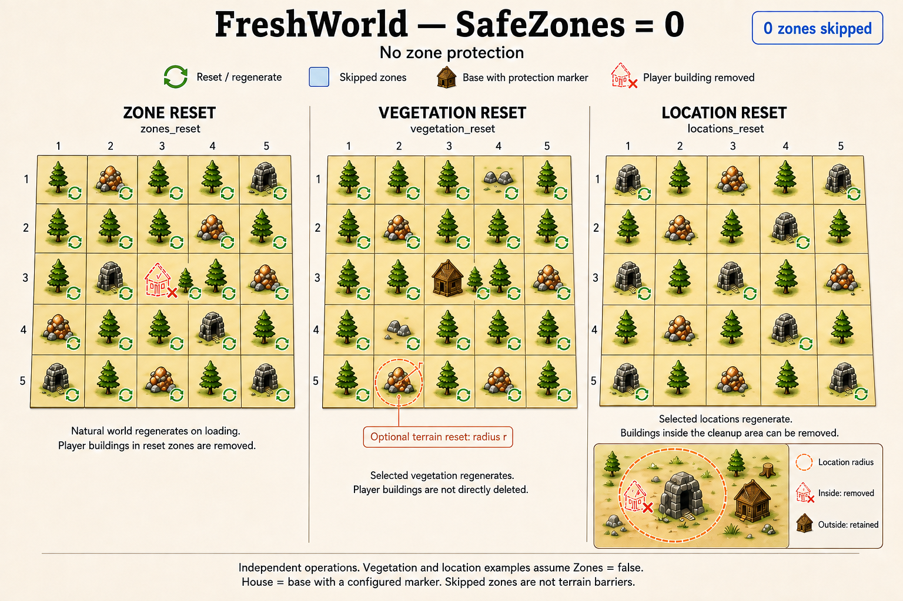
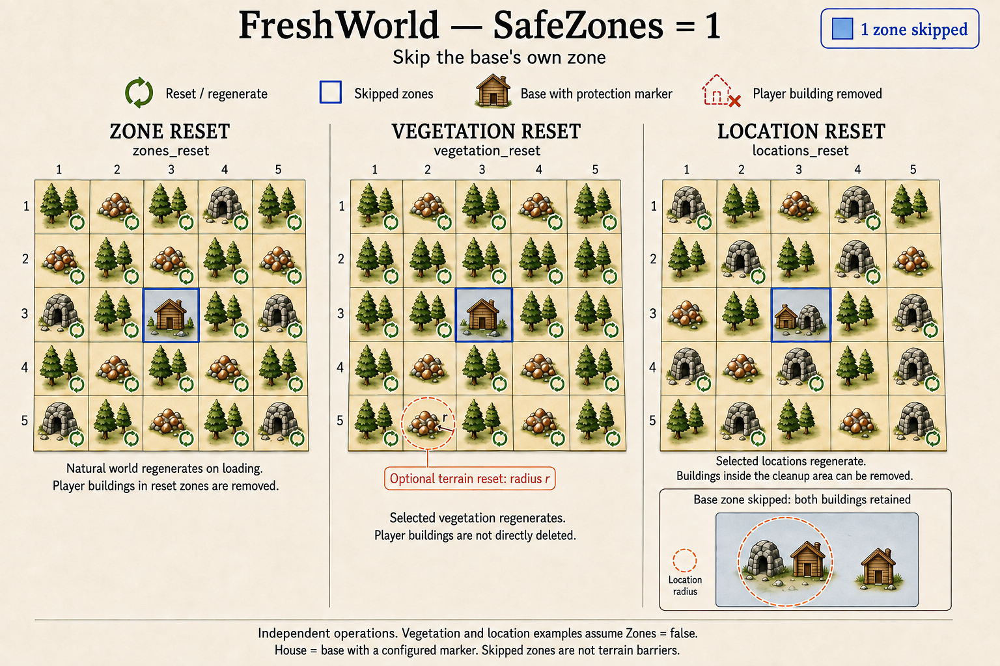
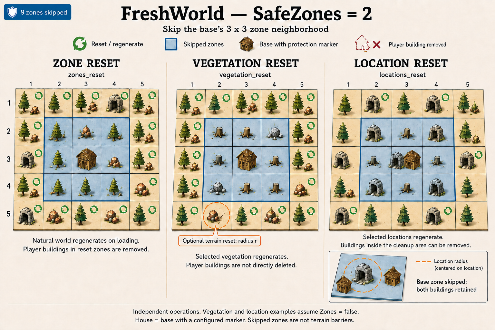

# FreshWorld SafeZones illustrations

SafeZones excludes whole zones from a reset stage. Each grid cell represents a **64 × 64 m zone**. Protection follows the zone containing a qualifying marker, rather than a fixed distance from the marker itself.

| SafeZones | Protection around one marker |
| --- | --- |
| `0` | No marker-based protection |
| `1` | The marker's zone: **1 cell** |
| `2` | The marker's zone and its eight neighbors: **3 × 3 cells** |

The house icon represents an automatic protection marker: a player-built Piece with `creator != 0` whose prefab is not in `PieceBlacklist`. The default blacklist contains `fire_pit`, so a lone campfire is not a marker. `Player_tombstone` is a separate marker without that creator requirement and is unaffected by the blacklist. Multiple markers combine their protected areas; all marker protection requires SafeZones greater than zero.

Circular arrows indicate reset targets. The zone reset panels show the result after later world loading regenerates the natural world. Player-built houses removed from eligible zones are not regenerated.

**SafeZones = 0 — no protected cells**

**SafeZones = 1 — protect the marker's cell**

**SafeZones = 2 — protect a 3 × 3 neighborhood**

Read each operation as an independent example. **The vegetation and location examples assume `Reset.Zones=false`.** FreshWorld configures protection separately for each stage:

| Operation shown | FreshWorld setting | What an eligible target can change |
| --- | --- | --- |
| `zones_reset` | `Protection.ZoneSafeZones` | Resets generated zones, removing player structures and restoring the natural world on later loading. Removed player structures do not regenerate. |
| `vegetation_reset` | `Protection.ResourceSafeZones` | Replaces selected vegetation and its matching resource fragments. `ResourceIds` does not restore terrain; `TerrainResourceIds` also restores terrain when `ResourceTerrainRadius` is greater than zero. Ordinary building pieces are not directly targeted. |
| `locations_reset` | `Protection.LocationSafeZones` | Regenerates selected placed locations. Objects inside the cleanup area, including player pieces, can be deleted. Terrain is restored using the location's exterior radius. |

Player characters are excluded from deletion in every stage.

A location is eligible according to its assigned zone. Its surface cleanup circle uses the exterior radius and selects objects **within that same sector**; it does not scan adjacent sectors for objects inside the circle. Objects above 4,000 m in that sector are also cleaned up for dungeon interiors, even outside the surface circle. The surface drawings do not depict this dungeon exception.

Protected cells are skipped as operation targets, but they are not an absolute terrain boundary. Resource and location terrain circles can extend into adjacent protected cells. Zone reset can also repair shared terrain height edges in retained neighboring zones. Terrain changes may affect building support even where pieces are not directly deleted.

With `Reset.Zones=true`, zone reset runs first. The extra resource and location stages then consider only initially protected zones that remain generated, applying their own SafeZones settings to those candidates. With `Reset.Zones=false`, their candidates are all generated zones, including zones that are not currently loaded. Disabling the extra stages does not prevent zone reset from affecting resources or locations.
